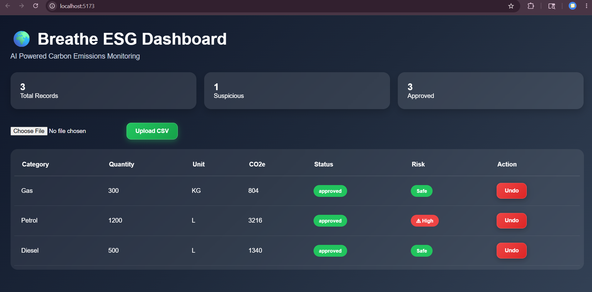
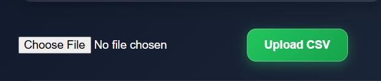
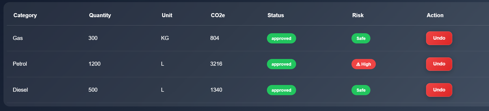

# 🌍 Breathe ESG Dashboard

A modern AI-powered ESG (Environmental, Social, Governance) emissions monitoring and audit dashboard built using **Django + React**.

This project helps organizations upload, track, and review carbon emission records with an intelligent approval workflow and suspicious activity detection system.

---

## 👩‍💻 Developed By

**Arti Kumari**  
B.Tech ECE, NIT Patna (2026)

---

## 🚀 Features

- 📂 CSV File Upload System
- 📊 Real-time ESG Emissions Dashboard
- ⚠️ Automatic Suspicious Data Detection
- ✅ Approval / Undo Workflow System
- 📈 Live Statistics Cards
- 🎨 Modern Glassmorphism UI
- 🔄 Auto-refresh after updates

---

## 🛠️ Tech Stack

### Frontend
- React.js
- Axios
- Inline CSS (Modern UI Design)

### Backend
- Django
- Django REST Framework
- SQLite / DB

---

## 📸 Screenshots

### Dashboard Overview


### Upload Feature


### Approval Workflow


---

## 📂 Project Structure

---

## 📄 Sample CSV Format

```csv
category,quantity,unit
Electricity,500,kWh
Travel,200,km
Fuel,1000,litre